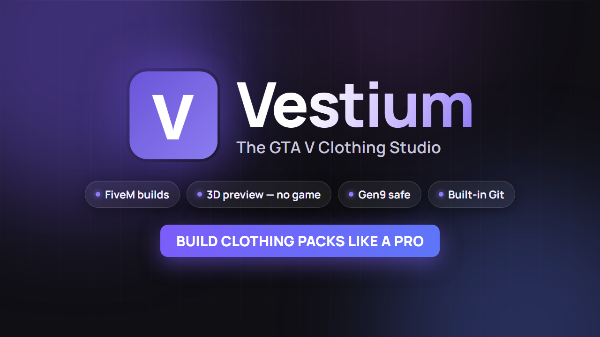

  

<h1 align="center">Vestium</h1>

<b>The GTA V Clothing Studio — build, preview, repair and ship FiveM clothing packs like a pro.</b>

  
  

  

---

## Download

Grab the latest **[Vestium-Setup.exe](https://github.com/SensityTech/Vestium/releases/latest)** (installer, auto-updates) or the portable build from the [releases page](https://github.com/SensityTech/Vestium/releases).

- **Windows 10/11 x64**
- Auto-updates: the app checks this repository and updates itself — install once, stay current.

## What is Vestium?

Vestium is a complete desktop studio for creating and managing GTA V addon clothing (FiveM first):

- **Import thousands of drawables in seconds** — names, genders, texture letters, physics, first-person models resolved automatically, content-deduplicated.
- **Animated 3D preview without launching the game** — full freemode ped, idle animations, live texture hot-swap, Photoshop live editing.
- **Optimization at scale** — real Blender LOD decimation, bulk texture re-encode (DXT/mips/pow2), parallel engine pool.
- **26+ live validations** before you ever hit build.
- **Byte-faithful FiveM builds** — addon collections AND replacement of real Rockstar DLCs, with DCT-compatible shop hashes so existing scripts and Tebex packages keep working.
- **Gen9/console safety** — reserved slots are scanned, locked and mirrored: your pack can never land on a dead index.
- **Repair tools** — re-open any compiled pack as an editable project, realign permuted texture letters by content hash, restore heels/flags from original packs.
- **`.vestfile` garment exchange** — export a complete garment as one portable file, bulk-import into any project with automatic pack placement.
- **Built-in Git collaboration** — LFS preconfigured, one-click private repo creation, team sync warnings.
- Bilingual **English/French**, dark & light themes, undo/redo everywhere.

## Issues & feedback

Found a bug or want a feature? [Open an issue](https://github.com/SensityTech/Vestium/issues) — include your Vestium version and, when relevant, the console output (Ctrl+L in the app).

## License

Vestium is proprietary software by SensityTech. This repository hosts the official builds and release notes only.
